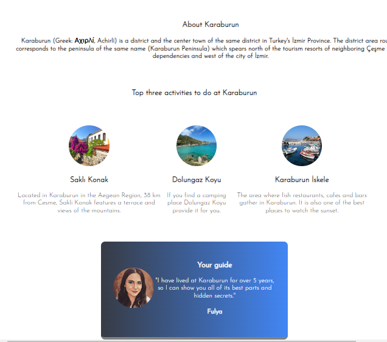

## Project: Scrimba Solo Project - Hometown Site

## Visulation of the App




## Description
```bash
- I created a solo project called "Hometown Homepage" of Module 2 on [Scrimba](https://scrimba.com/learn/htmlandcss/solo-project-hometown-homepage-cob2e4812840974342ebb42eb).
-You can see the visual representation of the app above.
```

## What I Learned?
```bash
-Mastered HTML/CSS.
- Classes
- Flexbox
- Background-image with linear gradients
- The color palette
- Google Fonts
```


## Stretch Goals: COMPLETED
```bash
- Make it about your own honetown, country or whatever place: Karaburun
- Use different color palette: [Colors](https://coolors.co/c7eae4-a7e8bd-fcbcb8-efa7a7-ffd972)
- Add Google Font: [Josefin Sans](https://fonts.google.com/specimen/Josefin+Sans)
- Find a way to use :hover: My images has transition attributes with hover pseudo class
- Add a whole new section: Karaburun About section added
```


Quick start:

```
$ npm install
$ npm start
````

Head over to https://vitejs.dev/ to learn more about using vite
## About Scrimba

At Scrimba our goal is to create the best possible coding school at the cost of a gym membership! 💜
If we succeed with this, it will give anyone who wants to become a software developer a realistic shot at succeeding, regardless of where they live and the size of their wallets 🎉
The Frontend Developer Career Path aims to teach you everything you need to become a Junior Developer, or you could take a deep-dive with one of our advanced courses 🚀

- [Our courses](https://scrimba.com/allcourses)
- [The Frontend Career Path](https://scrimba.com/learn/frontend)
- [Become a Scrimba Pro member](https://scrimba.com/pricing)

Happy Coding!
